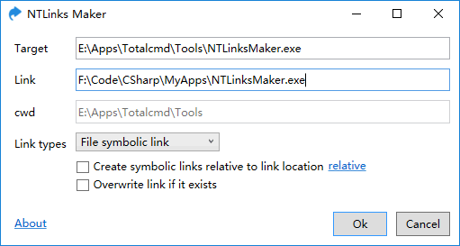

# NTLinks Maker

C# 小程序，创建 Symbolic links。

- 如果不填写 Link，表示在当前目录创建与 Target 同名的 Link。
- Windows 10 开启开发者模式之后，创建 Symbolic Link 不需要管理员权限。

[Download](https://pan.baidu.com/s/1miqIlO8)

Total Commander 将程序添加到竖向工具栏，Parameters: `%P%N %T%N`，即 Target Link。这与 Bash 的 ln 一致，而与 CMD 的 mklink 相反。

## License

MIT (c) Ivan Yan

[icon](https://www.iconfinder.com/icons/100270/shortcuts_icon)
